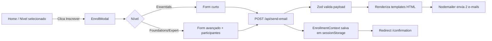

# Requestia Training Page

Landing page de inscrição para a **Trilha de Capacitação Requestia**. A aplicação apresenta os três níveis de treinamento (Essentials, Foundations e Expert), coleta as inscrições em modais com validação, envia e-mails de confirmação (participante + equipe interna) e mostra uma página de confirmação com os dados da inscrição.

Projeto gerado inicialmente no [v0.app](https://v0.app) e evoluído manualmente.

---

## Sumário

- [Stack](#stack)
- [Principais funcionalidades](#principais-funcionalidades)
- [Estrutura de pastas](#estrutura-de-pastas)
- [Fluxo end-to-end](#fluxo-end-to-end)
- [Configuração do ambiente](#configuração-do-ambiente)
- [Scripts](#scripts)
- [Variáveis de ambiente](#variáveis-de-ambiente)
- [Templates de e-mail](#templates-de-e-mail)
- [Deploy](#deploy)
- [Convenções e observações](#convenções-e-observações)

---

## Stack

- **Framework:** [Next.js 16](https://nextjs.org/) (App Router) + [React 19](https://react.dev/)
- **Linguagem:** TypeScript 5.7
- **UI:** [Tailwind CSS v4](https://tailwindcss.com/), [shadcn/ui](https://ui.shadcn.com/), [Radix UI](https://www.radix-ui.com/), [lucide-react](https://lucide.dev/)
- **Formulários:** [react-hook-form](https://react-hook-form.com/) + [Zod](https://zod.dev/)
- **E-mail:** [Nodemailer](https://nodemailer.com/) com templates HTML tokenizados
- **Estado global:** React Context + `sessionStorage`
- **Analytics:** [Vercel Analytics](https://vercel.com/analytics) + [Microsoft Clarity](https://clarity.microsoft.com/)
- **Package manager:** [pnpm](https://pnpm.io/)

---

## Principais funcionalidades

- **Trilha com 3 níveis** de treinamento configurados em [app/page.tsx](app/page.tsx):
  - `essentials` — online e gratuito (5h)
  - `foundations` — presencial em Campinas/SP (3 dias)
  - `expert` — presencial (3 dias)
- **Deep link de inscrição** via query string: acessar `/?inscricao=<id>` abre o modal do curso correto automaticamente (útil para campanhas de e-mail marketing).
- **Dois formulários** de inscrição:
  - [components/enroll-form-essentials.tsx](components/enroll-form-essentials.tsx) — versão curta para o curso gratuito.
  - [components/enroll-form-advanced.tsx](components/enroll-form-advanced.tsx) — versão completa (Foundations/Expert) com dados profissionais, responsável financeiro e **participantes adicionais**.
- **Validação centralizada** em [lib/form/validators.ts](lib/form/validators.ts), incluindo blacklist de domínios pessoais (gmail, hotmail, outlook…) para exigir e-mail corporativo.
- **Envio duplo de e-mail** por inscrição (participante + equipe interna) via SMTP.
- **Página de confirmação** ([app/confirmation/page.tsx](app/confirmation/page.tsx)) que persiste os dados em `sessionStorage` e sobrevive a reload.
- **Formulário de contato** ("tire suas dúvidas") em [components/contact-modal.tsx](components/contact-modal.tsx).
- **Observabilidade** com Microsoft Clarity e Vercel Analytics já integrados no [app/layout.tsx](app/layout.tsx).

---

## Estrutura de pastas

```
app/
  page.tsx                 # Landing com a trilha e seleção de nível
  layout.tsx               # Root layout, provider de inscrição, analytics
  confirmation/page.tsx    # Página pós-inscrição
  api/
    send-email/            # POST — envia e-mails da inscrição
    send-email-contact/    # POST — envia e-mail do formulário de contato
components/
  enroll-modal.tsx         # Modal que escolhe o formulário conforme o nível
  enroll-form-essentials.tsx
  enroll-form-advanced.tsx
  contact-modal.tsx
  form/                    # Componentes reutilizáveis de formulário
  feedback/                # Estados de feedback (sucesso/erro)
  ui/                      # shadcn/ui
  clarity/                 # Provider do Microsoft Clarity
contexts/
  enrollment-context.tsx   # Estado da inscrição + sessionStorage
hooks/
  use-additional-participants.ts
  use-contact-form.ts
lib/
  email/
    template-engine.ts     # Loader + tokenização de templates HTML
    templates/             # Renderers por cenário (essentials, internal, ...)
  form/validators.ts       # Validações de nome, e-mail corporativo, etc.
types/
  enrollment.ts            # Tipos centralizados da inscrição
public/
  *.html                   # Templates HTML dos e-mails
```

---

## Fluxo end-to-end



---

## Configuração do ambiente

### Pré-requisitos

- **Node.js** 20 ou superior
- **pnpm** 9+ (`npm install -g pnpm`)
- Acesso a um servidor SMTP para os envios de e-mail

### Instalação

```powershell
# clonar o repositório
git clone <url-do-repo>
cd v0-requestia-training-page

# instalar dependências
pnpm install

# criar arquivo de variáveis de ambiente
Copy-Item .env.example .env.local  # ou crie manualmente conforme a seção abaixo

# rodar em modo desenvolvimento
pnpm dev
```

A aplicação sobe em `http://localhost:3000`.

---

## Scripts

Definidos em [package.json](package.json):

| Comando      | Descrição                                    |
| ------------ | -------------------------------------------- |
| `pnpm dev`   | Sobe o servidor de desenvolvimento (Next.js) |
| `pnpm build` | Gera o build de produção                     |
| `pnpm start` | Executa o build de produção                  |
| `pnpm lint`  | Roda o ESLint                                |

---

## Variáveis de ambiente

Crie um arquivo `.env.local` na raiz com as chaves abaixo. Todas são consumidas pelas API routes em [app/api/send-email/route.tsx](app/api/send-email/route.tsx) e [app/api/send-email-contact/route.tsx](app/api/send-email-contact/route.tsx).

```env
# SMTP
SMTP_HOST=smtp.seuprovedor.com
SMTP_PORT=587
SMTP_USER=usuario@dominio.com
SMTP_PASS=sua-senha-ou-app-password
SMTP_FROM="Requestia Treinamentos <no-reply@dominio.com>"

# Destinatários internos (aceita múltiplos separados por vírgula ou ponto-e-vírgula)
MAIL_TO_INTERNAL=treinamentos@dominio.com,comercial@dominio.com
```

Observações:

- Se `SMTP_PORT=465` a conexão é feita em modo `secure` automaticamente.
- `MAIL_TO_INTERNAL` aceita lista separada por `,` ou `;`.
- Nunca commitar `.env.local`.

---

## Templates de e-mail

Os HTMLs vivem em [public/](public/) e são carregados/cacheados pelo engine em [lib/email/template-engine.ts](lib/email/template-engine.ts). A substituição usa tokens no formato `{nomeDoCampo}` com escape automático de HTML.

Templates atuais:

| Arquivo                                             | Uso                                       |
| --------------------------------------------------- | ----------------------------------------- |
| `essentials-inscricaorecebida-internal.html`        | E-mail interno — Essentials               |
| `fe-inscricaorecebido.html`                         | E-mail participante — Foundations/Expert  |
| `fe-inscricaorecebido-internal.html`                | E-mail interno — Foundations/Expert       |
| `fe-inscricao_1_participanterecebido.html`          | Participante adicional (1)                |
| `fe-inscricao_2_participanterecebido.html`          | Participante adicional (2)                |
| `fe-inscricao_1_participanterecebido-internal.html` | Cópia interna do participante adicional 1 |
| `fe-inscricao_2_participanterecebido-internal.html` | Cópia interna do participante adicional 2 |
| `duvida-formstreinamento.html`                      | Formulário de contato / dúvidas           |
| `treinamento-essentials.html`                       | Comunicação institucional Essentials      |

Renderizadores em [lib/email/templates/](lib/email/templates/): `essentials.ts`, `internal.ts`, `internal-essentials.ts`, `fe-participant.ts`, `contact.ts`.

---

## Deploy

O projeto está preparado para deploy na [Vercel](https://vercel.com/) (há a pasta `.vercel/` com o link do projeto). Para publicar:

1. Configure as variáveis de ambiente listadas acima em **Project Settings → Environment Variables**.
2. Faça push para a branch conectada — a Vercel executa `pnpm build` automaticamente.

Para deploy em outros ambientes basta um runtime Node 20+ capaz de rodar `pnpm build` e `pnpm start`.

---

## Convenções e observações

- **Tipos centralizados** em [types/enrollment.ts](types/enrollment.ts) — reutilize `Level`, `TrainingSession`, `AdditionalParticipant`, `ConfirmationData` etc. em vez de recriá-los.
- **Persistência de inscrição:** o `EnrollmentContext` sincroniza com `sessionStorage` (chave `enrollmentData`) para que `/confirmation` funcione após reload.
- **Validação de e-mail corporativo:** a blacklist em [lib/form/validators.ts](lib/form/validators.ts) rejeita domínios pessoais. Ao adicionar novos, atualize o array `EMAIL_DOMAIN_BLACKLIST`.
- **`next.config.mjs`** hoje ignora erros de TypeScript no build (`ignoreBuildErrors: true`) e desliga a otimização de imagens. Reavaliar antes de produção.
- **Arquivos residuais** conhecidos do scaffolding original (podem ser limpos):
  - [styles/globals.css](styles/globals.css) duplicado (o efetivo é [app/globals.css](app/globals.css)).
  - [hooks/use-toast.ts](hooks/use-toast.ts) x [components/ui/use-toast.ts](components/ui/use-toast.ts).
  - [hooks/use-mobile.ts](hooks/use-mobile.ts) x [components/ui/use-mobile.tsx](components/ui/use-mobile.tsx).
- **Logs de debug SMTP** em [app/api/send-email/route.tsx](app/api/send-email/route.tsx) imprimem quais envs estão setadas em caso de erro — úteis em dev, remover/silenciar em produção.
